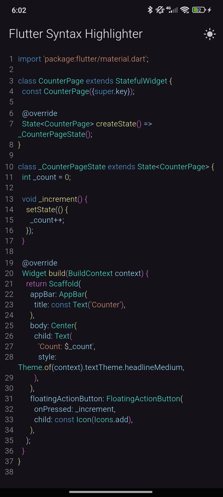

# Flutter Syntax Highlighter

Widget for Dart and Flutter code syntax highlighting, with support for light and dark themes, line numbering, and code selection.

### Screenshots

| Light Theme                                      | Dark Theme                                     |
| ------------------------------------------------ | ---------------------------------------------- |
|  |  |

## Video

[Watch the video demo](docs/videos/demo.mp4)

## Installation

Run this command:

```bash
flutter pub add flutter_syntax_highlighter
```

## Usage Example

```dart
import 'package:flutter/material.dart';
import 'package:flutter_syntax_highlighter/flutter_syntax_highlighter.dart';

void main() {
  runApp(const MyApp());
}

const String sampleCode = '''
import 'package:flutter/material.dart';

class CounterPage extends StatefulWidget {
  const CounterPage({super.key});

  @override
  State<CounterPage> createState() => _CounterPageState();
}

class _CounterPageState extends State<CounterPage> {
  int _count = 0;

  void _increment() {
    setState(() {
      _count++;
    });
  }

  @override
  Widget build(BuildContext context) {
    return Scaffold(
      appBar: AppBar(
        title: const Text('Counter'),
      ),
      body: Center(
        child: Text(
          'Count: $_count',
          style: Theme.of(context).textTheme.headlineMedium,
        ),
      ),
      floatingActionButton: FloatingActionButton(
        onPressed: _increment,
        child: const Icon(Icons.add),
      ),
    );
  }
}

''';

class MyApp extends StatefulWidget {
  const MyApp({super.key});

  @override
  State<MyApp> createState() => _MyAppState();
}

class _MyAppState extends State<MyApp> {
  bool _isDarkMode = false;
  bool _showLineNumbers = true;
  bool _enableCodeSelection = true;

  void _toggleTheme() {
    setState(() {
      _isDarkMode = !_isDarkMode;
    });
  }

  void _toggleLineNumbers() {
    setState(() {
      _showLineNumbers = !_showLineNumbers;
    });
  }

  void _toggleCodeSelection() {
    setState(() {
      _enableCodeSelection = !_enableCodeSelection;
    });
  }

  @override
  Widget build(BuildContext context) {
    return MaterialApp(
      title: 'Flutter Syntax Highlighter',
      theme: ThemeData.light(),
      darkTheme: ThemeData.dark(),
      themeMode: _isDarkMode ? ThemeMode.dark : ThemeMode.light,
      debugShowCheckedModeBanner: false,
      home: Scaffold(
        appBar: AppBar(
          title: const Text('Flutter Syntax Highlighter'),
          actions: <Widget>[
            IconButton(
              icon: Icon(_isDarkMode ? Icons.light_mode : Icons.dark_mode),
              onPressed: _toggleTheme,
              tooltip: 'Toggle Theme',
            ),
          ],
        ),
        body: SafeArea(
          child: Column(
            children: <Widget>[
              SwitchListTile(
                title: const Text('Show Line Numbers'),
                value: _showLineNumbers,
                onChanged: (value) => _toggleLineNumbers(),
              ),
              SwitchListTile(
                title: const Text('Enable Code Selection'),
                value: _enableCodeSelection,
                onChanged: (value) => _toggleCodeSelection(),
              ),
              SizedBox(height: 12.0),
              Expanded(
                child: Padding(
                  padding: const EdgeInsets.all(8.0),
                  child: SingleChildScrollView(
                    child: SyntaxHighlighter(
                      code: sampleCode,
                      isDarkMode: _isDarkMode,
                      showLineNumbers: _showLineNumbers,
                      enableCodeSelection: _enableCodeSelection,
                    ),
                  ),
                ),
              ),
            ],
          ),
        ),
      ),
    );
  }
}
```

## Properties

| Property              | Type     | Description                                 |
| --------------------- | -------- | ------------------------------------------- |
| `code`                | `String` | Source code to be displayed.                |
| `isDarkMode`          | `bool`   | Enables dark theme for syntax highlighting. |
| `showLineNumbers`     | `bool`   | Displays line numbers next to the code.     |
| `enableCodeSelection` | `bool`   | Allows selection of the displayed text.     |

## License

This project is licensed under the [MIT License](LICENSE).

# Author
This Flutter package was developed by [Dário Matias](https://github.com/dariomatias-dev).

# Donations

Help maintain the project with donations.

[](https://www.buymeacoffee.com/dariomatias)
